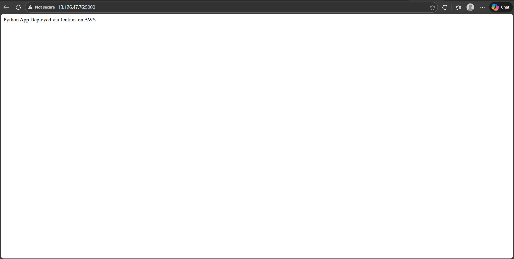

# Automated Code Testing and Deployment Pipeline

## Project Overview

In modern software development, manual testing and deployment are time-consuming and prone to errors. Jenkins is one of the most widely used automation servers that enables Continuous Integration and Continuous Deployment (CI/CD).

This project demonstrates how to build an **automated CI/CD pipeline** using **Jenkins** that:
- Automatically triggers on code push to GitHub
- Runs automated test cases
- Deploys a Python application to an AWS EC2 server after successful testing

---

## Objectives

- Automate code testing using Jenkins
- Integrate GitHub with Jenkins
- Implement automated testing using PyTest
- Deploy a Python application to AWS EC2
- Reduce manual intervention in build and deployment processes

---

## Tools and Technologies Used

- **Jenkins** – CI/CD automation server  
- **Git & GitHub** – Version control system  
- **Python** – Application development  
- **Flask** – Lightweight Python web framework  
- **PyTest** – Automated testing framework  
- **AWS EC2** – Application deployment server  
- **SSH** – Secure communication between Jenkins and EC2  

---

## Project Structure
```bash
python-ci-cd-project/
│
├── app.py # Flask application
├── test_app.py # PyTest test cases
├── requirements.txt # Python dependencies
├── Jenkinsfile # Jenkins pipeline script
└── README.md # Project documentation
```

---

## Step-by-Step Implementation

### Step 1: Create Python Application
- A basic Flask application is created to serve a simple HTTP response.
- This helps verify successful deployment via browser.

---

### Step 2: Add Automated Test Cases
- Test cases are written using **PyTest**.
- These tests validate application functionality before deployment.

---

### Step 3: Push Code to GitHub
- Application code, tests, dependencies, and Jenkinsfile are pushed to a GitHub repository.
- GitHub acts as the central version control system.

---

### Step 4: Install and Configure Jenkins
- Jenkins is installed on an Ubuntu server.
- Required plugins such as Git and Pipeline are installed.
- Jenkins is configured to execute pipeline jobs.

---

### Step 5: Integrate GitHub with Jenkins
- Jenkins pulls source code from GitHub using the pipeline.
- Pipeline is triggered automatically whenever code is pushed.

---

### Step 6: Jenkins Pipeline Configuration
The Jenkins pipeline consists of the following stages:
1. **Checkout Code** – Fetches code from GitHub  
2. **Install Dependencies** – Installs required Python packages  
3. **Run Tests** – Executes PyTest test cases  
4. **Deploy to AWS** – Deploys application to EC2 server  

---

### Step 7: Automated Testing
- Jenkins runs PyTest during pipeline execution.
- If any test fails, the pipeline stops.
- Deployment occurs only when all tests pass.

---

### Step 8: Deployment to AWS EC2
- Jenkins connects to AWS EC2 using SSH.
- The repository is cloned (if not already present) or updated.
- Dependencies are installed on the EC2 server.
- Flask application is started in the background.

---

### Step 9: Verification
- A code push triggers Jenkins automatically.
- Jenkins executes tests and deploys the application.
- Application is accessed via the EC2 public IP.

---

## Key Learning Outcomes

- Continuous Integration (CI)
- Continuous Deployment (CD)
- Jenkins pipeline automation
- Automated testing using PyTest
- GitHub integration with Jenkins
- Cloud deployment using AWS EC2
- Faster and reliable release cycles

---

## Conclusion

This project successfully demonstrates an **Automated Code Testing and Deployment Pipeline** using Jenkins. By integrating GitHub, PyTest, and AWS EC2, the pipeline ensures that only tested and verified code is deployed, improving software reliability and reducing manual effort.

---

